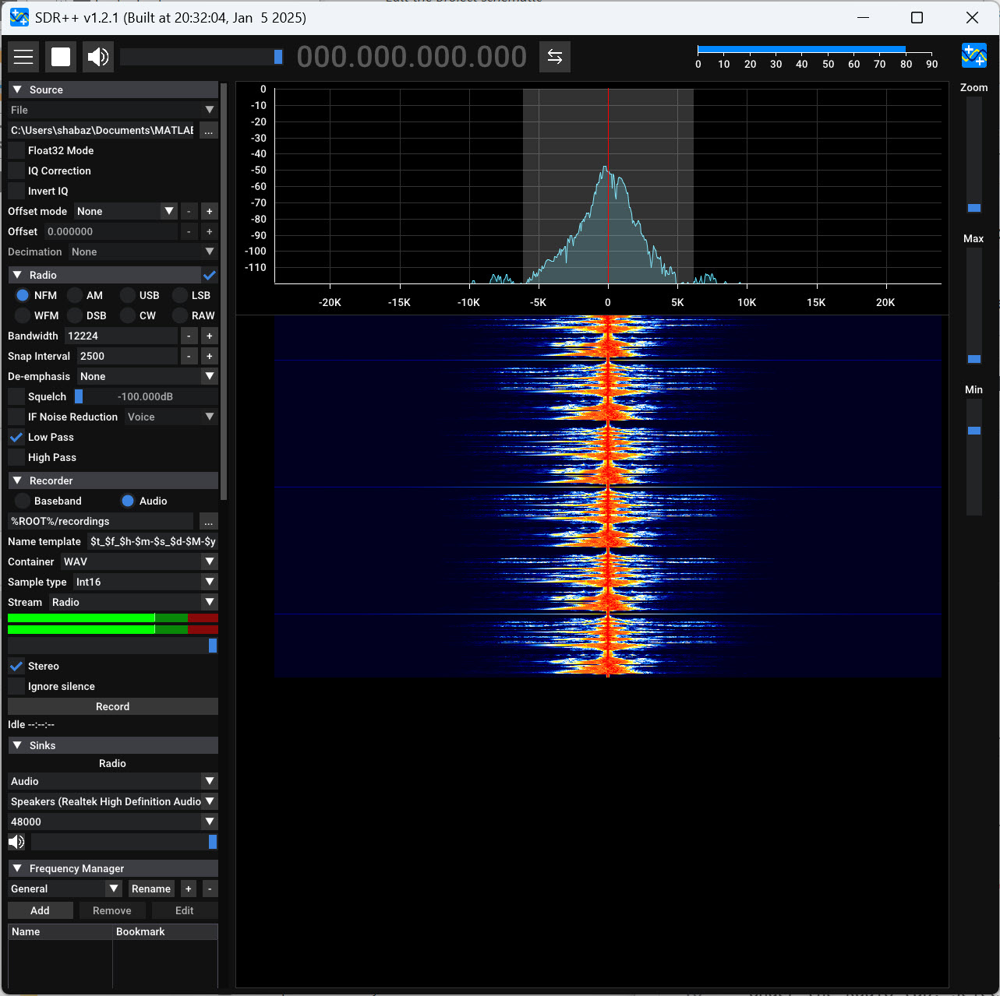

# fm_iq_create
A MATLAB script to create an I/Q WAV file containing baseband FM modulation.
The source audio input is taken from a normal mono WAV file (the example source file is called **eveshort-48-mono.wav**).

# How to Use It
Play the source audio file on your PC, just to familiarize yourself with what the source sounds like.

Next, if you run the **iq_create.m** script in MATLAB (by placing it in your usual MATLAB user folder, and then type **iq_create** in the command window, with no parameters required), it will transform the source WAV file into another WAV file, called **iq_file.wav**.

If you try to play the iq_file.wav using a normal media player, you'll hear distorted audio, since it is now modulated.

To convert back to normal sounding audio, you can use SDR receiver software. An example is [SDR++](https://github.com/AlexandreRouma/SDRPlusPlus/releases).

Run SDR++, then using the left side pane, working top-down, first select the Source tab to be set to File, and choose iq_file.wav.

Under the Radio tab, select NFM (Narrowband FM).

Scroll down and there should be a Source tab in the left side pane. Ensure it is set to your PC speakers. Sample rate should have defaulted to 48000.

At the top-left of the SDR++ application, click on the triangle (Play) button. You should hear very distorted audio; this is because there is a frequency offset. You need to set the offset to zero. The offset is shown at the top. Click on the digits to set it to zero.

